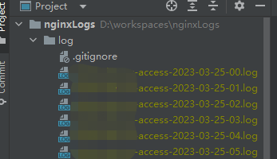

# 概述
分析nginx日志为以下格式的日志，其他格式按需修改
~~~
log_format  main  '$remote_addr - $remote_user [$time_local $request_time $upstream_response_time] "$request" '
        '$status $body_bytes_sent "$http_referer" '
        '"$http_user_agent" "$http_x_forwarded_for"';
~~~
## 初始配置
~~~
var conf = ConfStruct{
	User:     "root",
	Password: "root",
	Host:     "127.0.0.1",
	Port:     3306,
	Dbname:   "test",
	Params:   "charset=utf8mb4&collation=utf8mb4_unicode_ci&parseTime=true&loc=Local",
	//StartTime: "2023-02-27 11:45:57",
	//EndTime:   "2023-04-27 11:45:57",
	Reset: true,
}
~~~
### 用法
~~~
将nginx日志文件丢入到当前目录的log目录下即可，
~~~
### 示例

### 一共处理条数
~~~
SELECT count(*) AS 总次数 FROM request; 
~~~

### 访问最多的ip地址
~~~
SELECT method,remote_addr,count(*) AS 总次数 FROM request GROUP BY method,remote_addr ORDER BY 总次数 DESC;
~~~

### 平均响应时间
~~~
SELECT
	method,
	path,
	count(*) AS 总次数,
	FORMAT( SUM( upstream_response_time ), 2 ) AS 总耗时,
	FORMAT( AVG( upstream_response_time ), 2 ) AS 平均耗时 
FROM
	request 
GROUP BY
	method,
	path 
HAVING
	总次数 > 1 
ORDER BY
	总次数 DESC,
	平均耗时 DESC;
~~~

### 谋IP请求最多的接口
~~~
SELECT method,url,count(*) AS 总次数 FROM request WHERE remote_addr = "219.128.21.94" GROUP BY method,path ORDER BY 总次数 DESC;
~~~
